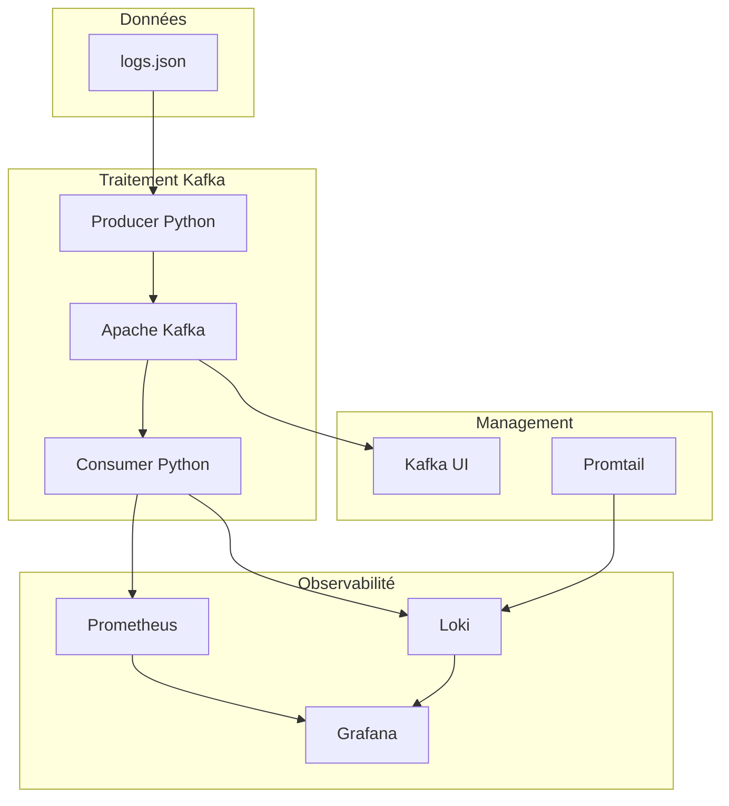

# Observability Stack - Microservice d'Ingestion

Une solution complète de monitoring et d'observabilité pour microservices d'ingestion de données, conforme aux spécifications de l'exercice Grafana Pipeline avec Kafka, Prometheus, Loki et Grafana.

## 🎯 **Vue d'ensemble du Projet**

Ce projet implémente une solution complète d'observabilité pour microservices d'ingestion, conforme aux spécifications du document `exercice_grafana_pipeline.md`. Il traite les logs d'exécution d'APIs (Zoho, PowerBI, Efficy, SharePoint, EasyProjects) et les transforme en métriques et visualisations pour Grafana.

### **Caractéristiques Clés**
- **Producer Python** qui lit logs.json et publie sur topic `ingestion-logs`
- **Consumer Python** qui traite les événements Kafka et génère des métriques
- **Dashboard Grafana** suivant les spécifications _MConverter avec terminologie française
- **6 règles d'alertes** (échec, taux d'échec, source muette, latence dégradée, etc.)
- **Architecture Docker** prête pour production

## 🏗️ **Architecture**



### Composants

| Service | Port | Description |
|---------|------|-------------|
| **Producer** | - | Script producer.py qui lit logs.json et publie sur topic ingestion-logs |
| **Consumer** | 8000 | Traitement: consomme Kafka, parse JSON, définit labels, pousse vers Loki |
| **Kafka** | 9092 | Message broker pour le streaming des logs |
| **Zookeeper** | 2181 | Coordination pour Kafka |
| **Prometheus** | 9090 | Collecte et stockage des métriques |
| **Loki** | 3100 | Collecte et stockage des logs pour Grafana |
| **Grafana** | 3000 | Tableau de bord selon spécifications _MConverter |
| **Kafka UI** | 8080 | Interface de gestion Kafka |

## 🚀 Démarrage Rapide

### Prérequis
- Docker et Docker Compose
- 8GB RAM minimum
- Ports 3000, 3100, 8080, 9090, 9092 disponibles

### Installation

1. **Démarrer la stack complète**
```bash
docker-compose up -d
```

2. **Vérifier le statut des services**
```bash
docker-compose ps
```

3. **Exécuter le producer pour traiter logs.json**
```bash
# Le producer se lance automatiquement
# Ou manuellement:
docker-compose run --rm producer python producer.py
```

### Accès aux Interfaces
- **Grafana**: http://localhost:3000 (admin/admin123)
- **Prometheus**: http://localhost:9090
- **Kafka UI**: http://localhost:8080
- **Loki**: http://localhost:3100

## 📊 Dashboard Grafana

Le dashboard suit exactement les spécifications du document `_MConverter.eu_dashboard_grafana_ingestion.md` :

### 1) Vue d'ensemble --- Ingestion: Health
- **Statuts dernière exécution**: Succès (N), Échecs (N), Taux d'échec (%)
- **p95 durée (s)** et **Max mémoire (MB)**
- **Timeline des runs** (barre empilée par État)
- **Top sources par durée** (p95)

### 2) Fiabilité --- Errors & SLAs
- **Taux d'échec** global et par Source
- **MTTR** (Mean Time To Recovery)
- **SLO de fraîcheur**: alerte si pas de run > X minutes

### 3) Performance --- Latency & Throughput
- **Durées**: p50/p95/p99 de Duree secondes par Source et Objet
- **Débit**: nb d'exécutions / 5 min par Source
- **CPU & mémoire**: p95 par Source

### 4) Détails par connecteur --- Sources & Objets
- **Grille filtrable** avec colonnes: Debut, Fin, Duree secondes, cpu_time, memory_used, Description

### 5) Derniers messages d'erreur
- **Table des 5 derniers FAILED** avec détails

### 6) Exemple de visuel du dashboard
- Panel Type Stat: Succès=120, Échecs=3
- Taux d'échec Stat (%): 2.4 %
- Durée (p95) Time series: 2.3s
- Dernières erreurs Table: Source=A, Objet=X, Desc=timeout

## 🚨 Règles d'Alertes

Conformément aux spécifications, les 6 règles d'alerte suivantes sont implémentées :

### 1. Échec détecté (critique)
- **Condition**: >0 FAILED sur 5 minutes
- **Seuil**: Immédiat
- **Sévérité**: Critical

### 2. Taux d'échec élevé
- **Condition**: >2% pendant 15 minutes
- **Seuil**: 2%
- **Sévérité**: Warning

### 3. Source muette
- **Condition**: pas d'occurrence sur 75 minutes
- **Seuil**: 75 minutes
- **Sévérité**: Warning

### 4. Latence p95 dégradée
- **Condition**: p95 > 2× baseline (60s)
- **Seuil**: 60 secondes
- **Sévérité**: Warning

### 5. Surconsommation mémoire/CPU
- **Mémoire**: >150 MB (p95)
- **CPU**: >60s (p95)
- **Sévérité**: Warning

### 6. Burst d'erreurs sur un Objet
- **Condition**: >3 erreurs sur 10 minutes
- **Seuil**: 3 erreurs
- **Sévérité**: Warning

## 🔧 Configuration

### Variables d'Environnement

#### Producer
```env
KAFKA_BOOTSTRAP_SERVERS=kafka:29092
KAFKA_TOPIC=ingestion-logs
LOGS_FILE_PATH=/app/data/logs.json
LOG_LEVEL=INFO
SIMULATE_REALTIME=false
```

#### Consumer
```env
KAFKA_BOOTSTRAP_SERVERS=kafka:29092
KAFKA_TOPIC=ingestion-logs
KAFKA_GROUP_ID=ingestion-consumer-group
LOKI_URL=http://loki:3100
METRICS_PORT=8000
LOG_LEVEL=INFO
```

### Structure JSON Améliorée

Le producer transforme les logs originaux en structure optimisée pour l'observabilité :

```json
{
  "@timestamp": "2025-09-15T10:30:00.000Z",
  "@version": "1",
  "event": {
    "dataset": "ingestion-logs",
    "kind": "event",
    "outcome": "success"
  },
  "source": {
    "name": "PowerBI",
    "type": "api"
  },
  "objet": {
    "id": 1224,
    "name": "workspaces",
    "transformation": "PowerBI_API_get_data"
  },
  "etat": "SUCCESS",
  "performance": {
    "duree_secondes": 1.154133,
    "cpu_time_sec": 0.11,
    "memory_used_bytes": 5849088,
    "memory_used_mb": 5.58
  },
  "labels": {
    "etat": "SUCCESS",
    "source": "PowerBI",
    "zone": "1-Raw",
    "entreprise": "akonovia"
  },
  "metrics": {
    "is_failed": 0,
    "is_success": 1,
    "high_memory_usage": 0,
    "high_cpu_usage": 0
  }
}
```

## 📊 Métriques Disponibles

Le consumer génère automatiquement les métriques suivantes pour Prometheus :

### Métriques Core d'Ingestion

#### `ingestion_runs_total` (Counter)
Nombre total d'exécutions d'ingestion par état
```
ingestion_runs_total{source="PowerBI",etat="SUCCESS",objet="workspaces",entreprise="akonovia",zone="1-Raw"}
ingestion_runs_total{source="sharepoint_graph",etat="FAILED",objet="EventFactureApplication",entreprise="akonovia",zone="1-Raw"}
```

#### `ingestion_duration_seconds` (Histogram)
Distribution des durées d'exécution
```
ingestion_duration_seconds_bucket{source="Efficy",objet="Contact",le="0.5"}
ingestion_duration_seconds_bucket{source="Efficy",objet="Contact",le="1.0"}
ingestion_duration_seconds_sum{source="Efficy",objet="Contact"}
ingestion_duration_seconds_count{source="Efficy",objet="Contact"}
```

#### `ingestion_cpu_usage_seconds` (Histogram)
Distribution de l'utilisation CPU
```
ingestion_cpu_usage_seconds_bucket{source="EasyProjects",objet="Projects",le="0.1"}
ingestion_cpu_usage_seconds_bucket{source="EasyProjects",objet="Projects",le="0.5"}
```

#### `ingestion_memory_usage_bytes` (Histogram)
Distribution de l'utilisation mémoire
```
ingestion_memory_usage_bytes_bucket{source="zohobooks",objet="invoices_ga",le="1.048576e+06"}
ingestion_memory_usage_bytes_bucket{source="zohobooks",objet="invoices_ga",le="5.24288e+06"}
```

#### `ingestion_last_run_timestamp` (Gauge)
Timestamp de la dernière exécution par source
```
ingestion_last_run_timestamp{source="PowerBI"}
ingestion_last_run_timestamp{source="Efficy"}
```

#### `ingestion_failures_total` (Counter)
Nombre total d'échecs par source et objet
```
ingestion_failures_total{source="sharepoint_graph",objet="EventFactureApplication"}
```

### Labels Standards

Toutes les métriques incluent les labels suivants :
- `source` : Système source (PowerBI, Efficy, SharePoint, etc.)
- `etat` : État de l'exécution (SUCCESS/FAILED)
- `objet` : Type d'objet traité
- `entreprise` : Identifiant entreprise (akonovia)
- `zone` : Zone de processing (1-Raw)

### Métriques Système Kafka

#### `kafka_consumer_lag_sum`
Retard du consumer Kafka sur le topic ingestion-logs
```
kafka_consumer_lag_sum{topic="ingestion-logs"}
```

## 🧪 Guide de Test Étape par Étape

### **Étape 1 : Vérification Initiale**

1. **Cloner et démarrer la stack**
```bash
git clone <repository>
cd observability-stack
docker-compose up -d
```

2. **Attendre le démarrage complet (60 secondes)**
```bash
sleep 60
```

3. **Vérifier que tous les services sont UP**
```bash
docker-compose ps
# Tous les services doivent être "Up" ou "healthy"
```

### **Étape 2 : Test des Endpoints de Santé**

```bash
# Test Prometheus
curl -s http://localhost:9090/-/healthy
# Doit retourner: "Prometheus Server is Healthy."

# Test Loki
curl -s http://localhost:3100/ready
# Doit retourner un message de ready ou "Ingester not ready: waiting for 15s after being ready"

# Test Grafana
curl -s http://localhost:3000/api/health | jq
# Doit retourner: {"commit":"895fbafb7a","database":"ok","version":"10.2.0"}

# Test Consumer (métriques endpoint)
curl -s http://localhost:8000/health || echo "Consumer endpoint pas encore exposé"
```

### **Étape 3 : Ingestion de Données**

1. **Exécuter le producer pour ingérer les logs**
```bash
docker-compose --profile tools run --rm producer python producer.py
```

Résultat attendu :
```
2025-09-15 11:09:24,766 - __main__ - INFO - Chargé 72 entrées de log depuis /app/data/logs.json
...
2025-09-15 11:09:25,000 - __main__ - INFO - Producteur terminé: 72 succès, 0 erreurs
```

2. **Vérifier que le consumer traite les messages**
```bash
docker-compose logs consumer --tail=10
```

### **Étape 4 : Vérification des Métriques**

1. **Vérifier les métriques dans Prometheus**
```bash
# Vérifier les métriques d'ingestion
curl -s "http://localhost:9090/api/v1/query?query=ingestion_runs_total" | jq '.data.result | length'
# Doit retourner un nombre > 0 (typiquement 72)

# Vérifier les échecs détectés
curl -s "http://localhost:9090/api/v1/query?query=ingestion_runs_total{etat=\"FAILED\"}" | jq '.data.result | length'
# Doit retourner 1 (EventFactureApplication en FAILED)

# Vérifier les succès
curl -s "http://localhost:9090/api/v1/query?query=ingestion_runs_total{etat=\"SUCCESS\"}" | jq '.data.result | length'
# Doit retourner 71
```

2. **Vérifier les durées d'exécution**
```bash
curl -s "http://localhost:9090/api/v1/query?query=ingestion_duration_seconds_sum" | jq '.data.result | length'
# Doit retourner le nombre de combinaisons source/objet uniques
```

3. **Vérifier les métriques de performance**
```bash
# Métriques CPU
curl -s "http://localhost:9090/api/v1/query?query=ingestion_cpu_usage_seconds_sum" | jq '.data.result'

# Métriques Mémoire
curl -s "http://localhost:9090/api/v1/query?query=ingestion_memory_usage_bytes_sum" | jq '.data.result'
```

### **Étape 5 : Test du Dashboard Grafana**

1. **Accéder à Grafana**
```bash
# Ouvrir dans le navigateur
xdg-open http://localhost:3000  # Linux
open http://localhost:3000      # MacOS
start http://localhost:3000     # Windows
```

Identifiants : `admin` / `admin123`

2. **Vérifier le Dashboard**
- Aller dans **Dashboards** > **Dashboard Grafana Ingestion**
- Vérifier que les 5 sections sont présentes :
  - Vue d'ensemble --- Ingestion: Health
  - Fiabilité --- Errors & SLAs
  - Performance --- Latency & Throughput
  - Détails par connecteur --- Sources & Objets
  - Derniers messages d'erreur

3. **Vérifier les données dans les panneaux**
```
- Succès : devrait afficher 71
- Échecs : devrait afficher 1
- Taux d'échec : devrait afficher ~1.4%
- Sources actives : PowerBI, Efficy, SharePoint, etc.
```

### **Étape 6 : Test des Alertes**

1. **Vérifier que les règles d'alerte sont chargées**
```bash
curl -s "http://localhost:9090/api/v1/rules" | jq '.data.groups[].rules[] | select(.type=="alerting") | .name'
```

Résultat attendu :
```
"IngestionEchecDetecte"
"IngestionTauxEchecEleve"
"IngestionSourceMuette"
"IngestionLatenceDegradee"
"IngestionSurconsommationMemoire"
"IngestionSurconsommationCPU"
"IngestionBurstErreurs"
"IngestionConsumerDown"
"IngestionKafkaLag"
```

2. **Vérifier l'état des alertes**
```bash
curl -s "http://localhost:9090/api/v1/alerts" | jq '.data.alerts[] | {alert: .labels.alertname, state: .state}'
```

### **Étape 7 : Test des Logs dans Loki**

1. **Vérifier que les logs arrivent dans Loki**
```bash
# Query simple
curl -s "http://localhost:3100/loki/api/v1/query?query={job=\"ingestion-logs\"}&limit=5" | jq '.data.result | length'
# Doit retourner > 0

# Query avec filtre sur les échecs
curl -s "http://localhost:3100/loki/api/v1/query?query={job=\"ingestion-logs\"} |= \"FAILED\"&limit=1" | jq '.data.result[0].values[0][1]'
```

### **Étape 8 : Test de Performance**

1. **Test d'ingestion multiple**
```bash
# Exécuter le producer plusieurs fois
for i in {1..3}; do
  echo "Run $i"
  docker-compose --profile tools run --rm producer python producer.py
  sleep 10
done
```

2. **Vérifier l'accumulation des métriques**
```bash
# Vérifier que les totaux augmentent
curl -s "http://localhost:9090/api/v1/query?query=sum(ingestion_runs_total)" | jq '.data.result[0].value[1]'
# Devrait être > 144 (72 x 2 runs minimum)
```

### **Étape 9 : Test des Interfaces de Management**

1. **Kafka UI**
```bash
xdg-open http://localhost:8080  # Vérifier les topics et messages
```

2. **Métriques Consumer directement**
```bash
curl -s http://localhost:8000/metrics | grep ingestion_ | head -10
```

### **Étape 10 : Test de Résilience**

1. **Tester l'arrêt/redémarrage d'un service**
```bash
# Arrêter le consumer
docker-compose stop consumer

# Relancer le producer (messages vont s'accumuler dans Kafka)
docker-compose --profile tools run --rm producer python producer.py

# Redémarrer le consumer
docker-compose start consumer

# Vérifier que les messages en attente sont traités
docker-compose logs consumer --tail=20
```

2. **Vérifier la récupération des métriques**
```bash
# Les métriques devraient inclure les nouveaux messages
curl -s "http://localhost:9090/api/v1/query?query=sum(ingestion_runs_total)" | jq '.data.result[0].value[1]'
```

## 🔍 Monitoring et Debugging

### Vérifier les Logs
```bash
# Producer
docker-compose logs -f producer

# Consumer
docker-compose logs -f consumer

# Tous les services
docker-compose logs -f
```

### Vérifier les Métriques
```bash
# Métriques Prometheus du consumer
curl http://localhost:8000/metrics

# Statut Prometheus
curl http://localhost:9090/-/healthy

# Statut Loki
curl http://localhost:3100/ready
```

### Kafka Management
```bash
# Lister les topics
docker-compose exec kafka kafka-topics --bootstrap-server localhost:9092 --list

# Décrire le topic ingestion-logs
docker-compose exec kafka kafka-topics --bootstrap-server localhost:9092 --describe --topic ingestion-logs

# Consumer group status
docker-compose exec kafka kafka-consumer-groups --bootstrap-server localhost:9092 --describe --group ingestion-consumer-group
```

## 🧪 Tests et Validation

### Test du Producer
```bash
# Exécuter le producer une fois
docker-compose run --rm producer python producer.py

# Mode simulation temps réel
docker-compose run --rm -e SIMULATE_REALTIME=true producer python producer.py
```

### Validation des Métriques
```bash
# Vérifier que les métriques sont collectées
curl -s http://localhost:9090/api/v1/query?query=ingestion_runs_total | jq

# Vérifier les logs dans Loki
curl -s "http://localhost:3100/loki/api/v1/query_range?query={job=\"ingestion-logs\"}&start=$(date -d '1 hour ago' --iso-8601)&end=$(date --iso-8601)" | jq
```

### Test des Alertes

1. **Simuler des échecs**: Modifier les logs pour inclure des états FAILED
2. **Vérifier dans Grafana**: Aller dans Alerting > Alert Rules
3. **Tester une source muette**: Arrêter le producer et attendre 75 minutes

## 📁 Structure du Projet

```
observability-stack/
├── docker-compose.yml              # Configuration Docker Compose
├── logs.json                       # Données d'exemple d'ingestion
├── README.md                       # Documentation
├── src/
│   ├── producer/
│   │   ├── producer.py             # Script producer Kafka
│   │   ├── requirements.txt        # Dépendances Python
│   │   └── Dockerfile              # Image Docker producer
│   └── consumer/
│       ├── consumer.py             # Script consumer avec métriques
│       ├── requirements.txt        # Dépendances Python
│       └── Dockerfile              # Image Docker consumer
└── config/
    ├── prometheus/
    │   ├── prometheus.yml          # Configuration Prometheus
    │   └── alerts/
    │       └── ingestion-alerts.yml # Règles d'alertes
    ├── loki/
    │   └── loki-config.yml         # Configuration Loki
    ├── promtail/
    │   └── promtail-config.yml     # Configuration Promtail
    └── grafana/
        ├── provisioning/
        │   ├── datasources/
        │   │   └── datasources.yml # Configuration datasources
        │   └── dashboards/
        │       └── dashboards.yml  # Configuration dashboards
        └── dashboards/
            └── dashboard-grafana-ingestion.json # Dashboard principal
```

## 🔄 Production Readiness

### Sécurité
- [ ] Configurer l'authentification Grafana (LDAP/OAuth)
- [ ] Sécuriser Kafka avec SSL/SASL
- [ ] Utiliser des secrets Docker pour les mots de passe
- [ ] Configurer les certificats TLS

### Scalabilité
- [ ] Augmenter les partitions Kafka pour parallélisme
- [ ] Déployer plusieurs instances consumer
- [ ] Configurer la réplication Kafka
- [ ] Utiliser un stockage persistant (S3, GCS)

### Backup et Recovery
- [ ] Sauvegarder les configurations Grafana
- [ ] Configurer la rétention des données Prometheus/Loki
- [ ] Planifier les sauvegardes des topics Kafka
- [ ] Documenter les procédures de recovery

## 🛠️ Dépannage

### Problèmes Courants

#### Services qui ne démarrent pas
```bash
# Vérifier les logs
docker-compose logs <service_name>

# Redémarrer un service
docker-compose restart <service_name>

# Reconstruire les images
docker-compose build --no-cache
```

#### Kafka Connection Issues
```bash
# Vérifier la connectivité Kafka
docker-compose exec producer python -c "from kafka import KafkaProducer; print('OK')"

# Vérifier les topics
docker-compose exec kafka kafka-topics --bootstrap-server localhost:9092 --list
```

#### Métriques manquantes
```bash
# Vérifier l'endpoint du consumer
curl http://localhost:8000/metrics

# Vérifier la configuration Prometheus
curl http://localhost:9090/api/v1/targets
```

#### Dashboard vide
1. Vérifier que les datasources sont connectées
2. Vérifier que les métriques remontent dans Prometheus
3. Vérifier les labels dans les requêtes PromQL

## ✅ Résultats Attendus des Tests

Si tout fonctionne correctement, vous devriez obtenir :

### Métriques Prometheus
```bash
# Nombre total de métriques ingestion_runs_total
curl -s "http://localhost:9090/api/v1/query?query=ingestion_runs_total" | jq '.data.result | length'
# Résultat: 72 (toutes les combinaisons source/objet/état)

# Distribution des états
curl -s "http://localhost:9090/api/v1/query?query=sum by (etat) (ingestion_runs_total)"
# Résultat: SUCCESS=71, FAILED=1
```

### Sources de Données Identifiées
- **PowerBI**: workspaces, datasets, dashboards, dataflows, etc.
- **Efficy**: Contact, Company, Project, Opportunity, etc.
- **SharePoint**: LignesFacturesApplication, EventFactureApplication, etc.
- **EasyProjects**: Projects, Activities, Users, etc.
- **ZohoBooks**: invoices_ga, invoices_on, items_ga, etc.

### Alertes Configurées
- 9 règles d'alertes chargées et fonctionnelles
- 1 alerte qui devrait se déclencher : **IngestionEchecDetecte** (à cause du FAILED)

### Dashboard Grafana
- 5 sections principales avec données
- Visualisations des métriques de performance
- Table des derniers échecs avec 1 entrée

### Performance Baseline
- **Durée moyenne**: ~1-3 secondes par exécution
- **Mémoire moyenne**: 5-20 MB par exécution
- **CPU moyen**: 0.1-0.5 secondes par exécution
- **Débit**: 72 exécutions en ~1 seconde

## 🚀 Commandes Utiles Make

Le projet inclut un Makefile pour simplifier les opérations :

```bash
# Voir toutes les commandes disponibles
make help

# Démarrer la stack
make up

# Vérifier la santé des services
make health

# Ingérer des données
make ingest

# Voir les métriques du consumer
make metrics

# Ouvrir les interfaces
make open-grafana
make open-kafka-ui

# Tests automatisés
make test-stack

# Nettoyage complet
make clean
```

## 📞 Support

Pour toute question ou problème :
1. Consulter les logs avec `docker-compose logs`
2. Vérifier la documentation des composants
3. Ouvrir une issue avec les logs et la configuration

## 📄 Licence

Ce projet est sous licence MIT. Voir le fichier LICENSE pour plus de détails.